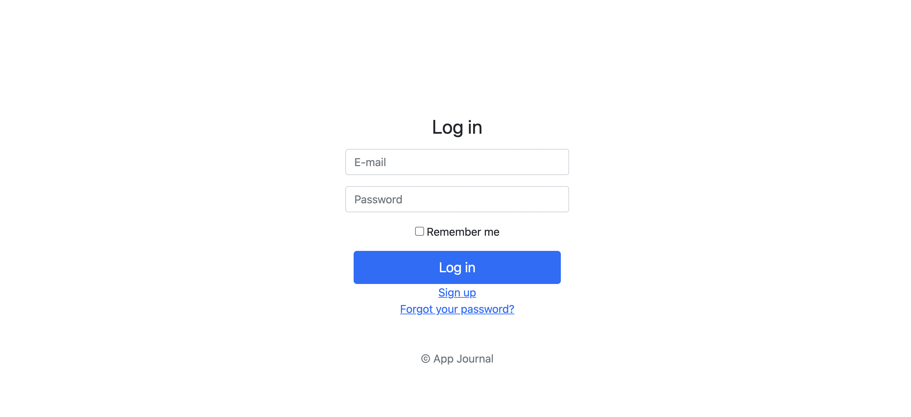
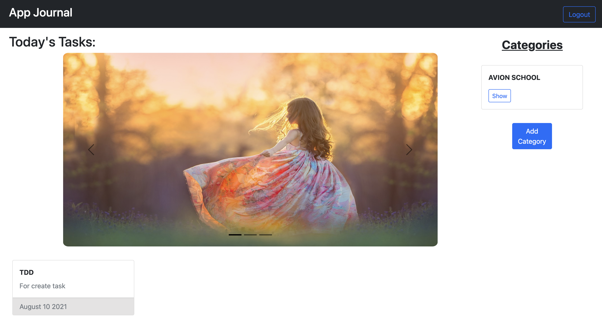
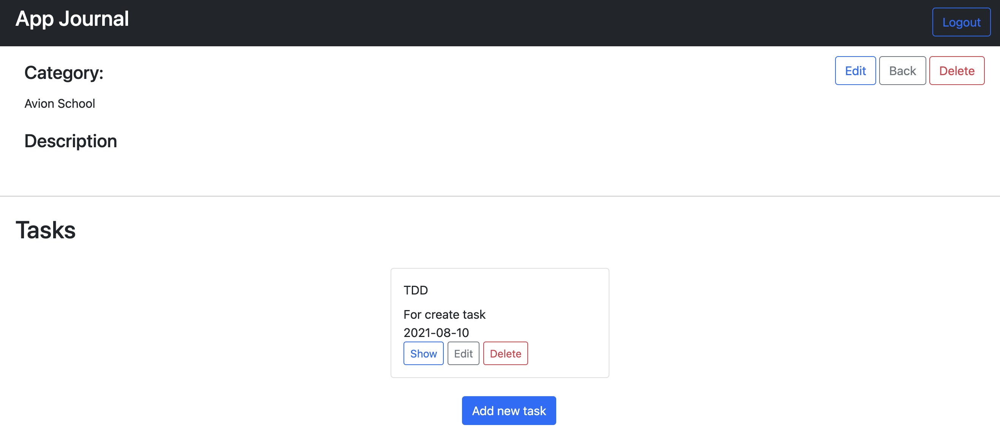
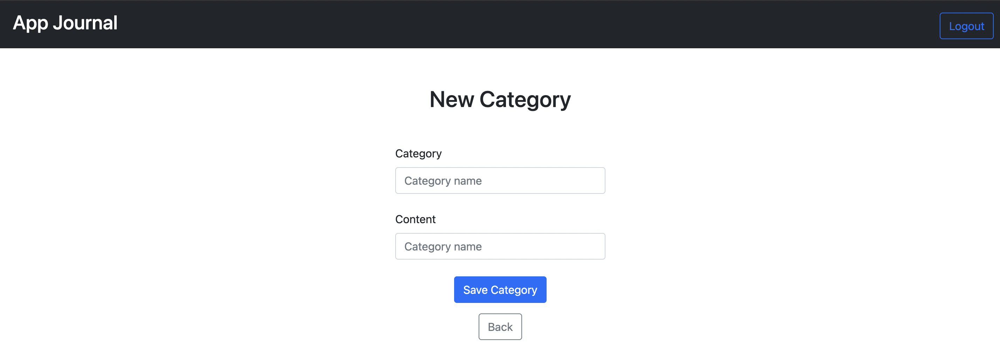

# 🚀 App Journal

Web app written in Ruby on Rails which allows a user to add tasks, link them to categories and displays the tasks due today on the home page.

[Live preview](https://journal-app01.herokuapp.com/)

## 🛠 Tech Stacks:

- Ruby 2.7.3
- Rails 6.1.4
- Postgresql
- Heroku
- Bootstrap
- Devise (User authentication)
- RSpec (TDD)

## 👩‍💻👨‍💻 Developers:

[jjhay-bot](https://github.com/jjhay-bot)
[lea927](https://github.com/lea927)

## 📷 Sample screenshots:

